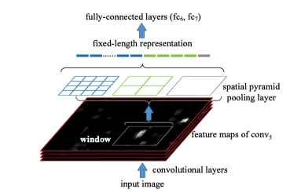

# RCNN 系列
## RCNN
1. 用selective search 在输入到图像上找到2k个肯能为目标的目标框（roi）
2. 将每一个roi通过crop或wrap的方法，处理成统一维度
3. 将roi输入到conv+fc中，最后一层输出单通道的4096维数据。这里的conv可以是任何通用模型，例如vgg。
4. 将4096维数据通过线性svm和bound-box regressors 做最后的分类和定位。

### 创新点
1. 采用大样本下预训练和小样本下微调的方法，解决小样本难以训练甚至过拟合的问题。

### 不足
1. CNN requires fixed-size(277*277)
2. Training is a multi-stage pipeline. CNN=>SVM>bounding-box regressors
3. Training is expensive in space and time.
4. Obtained region proposals are still redundant and this procedure is time-consuming.
5. 训练过程需要分两步，先将region proposal generation 生成的roi图像存储到本地，再训练svm。

## SPP-net
为了解决R-CNN中，region proposal必须处理成统一维度的缺点，spp-net在卷积层与全连接层中间加入了spatial pyramid pooling 层。卷积层提取出不同维度的feature map，经过spp处理成相同维度的特征，输入全连接层。

### spatial pyramid pooling
输入`a x a`的feature map，进行`n x n`的pooling。则pooling的kernel size 和 stride 为 `a/n`。

当a=13时，spp的配置参数

Spp-net 不仅提高了准确度，而且提高了检测效率，因为每张图片只做一次cnn的特征提取，在提取出来的feature map 上截取出region proposal 做池化和全连接计算。

### drawback
1. 不同尺度的图片会导致spp的back-propagation效率很低。

## Fast rcnn
### 模型流程
1. 用SS对输入图片做ROI提取
2. 用神经网络对输入图片做特征提取
3. 用ROI pooling层，将每一个ROI的特征图输出成一个7x7的特征图
4. 将特征图输入两个串联的主全连接层以及两个并联的子全连接层，从而利用子全连接层对目标做分类和定位。

### 创新点 
1. 加入multi-task loss，使得除了region proposal generation外，其余的网络可以一起训练，不用像rcnn 和spp-net那样，分别训练cnn和svm。
2. 取消spp，加入roi pooling，roi pooling 只做一层pooling，spp是多层pooling。
3. rcnn与sppnet是对一幅图像上的每一个roi分别做特征提取，而fast rcnn 是对一幅图像整体做一次特征提取。
4. 采用SVD对网络尾部并行的全连接层进行分解，减少计算复杂度，加快检测速度。

## Faster rcnn
Faster rcnn = RPN + Fast rcnn(ss之后的网络）

### 创新点
1. 用region proposals network 替代 SS作为提取Roi点方法。

### Train
#### Train RPN
1. 图片输入到卷积网络中，输出feature maps（假设维度为NxN）
2. feature maps 输入到RPN中，首先，作者使用一个输入为3x3的网络，作为滑动窗口扫描特征图，每一次输入256-d（ZF）或512-d（VGG）的特征向量。每个网络对应的感受野为171（ZF）、228（VGG）。接着，将为一组特征向量后接两个并行的全链接层，分别输出2k scores 和 4k coordinates。k表示anchor boxes的个数。==这里的coordinates不是bbox的坐标，而是与anchor box的差值。==
3. 确定anchor box，训练时会为两类anchor boxes标注正例：
    1. 与groud-truth box的iou大于0.7的，注意，一个groud-truth box可能会将多个anchor boxes 标注正例。
    2. 如果没有一个anchor box 与 groud-truth box 的iou大于0.7，则取iou最大的anchor box 标注正例。
    anchor boxes反例：与所有groud-truth boxes的iou均小于0.3的anchor boxes。
4. anchor box 的中心点是滑动窗口。一组3x3的输入，与之对应的有k个anchor boxes、2k个scores、4k个coordinates。针对每一组输入，首先，确认k个anchor boxes中，哪些是正例、哪些是反例、哪些不参与计算。接着将正反例anchor boxes和与之对应的scores、coordinates一同计算loss function，并做反向传播。训练RPN。
$$\begin{aligned} L\left(\left\{p_{i}\right\},\left\{t_{i}\right\}\right)=& \frac{1}{N_{c l s}} \sum_{i} L_{c l s}\left(p_{i}, p_{i}^{*}\right) +\lambda \frac{1}{N_{r e g}} \sum_{i} p_{i}^{*} L_{r e g}\left(t_{i}, t_{i}^{*}\right) \end{aligned}$$

#### Train Fast RCNN
1. 用RPN输出2000个proposals。proposals中有正例有反例。RPN训练时只对正例的坐标计算损失，而没有计算反例坐标的损失，因此，输出的正例坐标趋近于anchor boxes，而反例坐标则飘忽不定。（不确定这里是不是有反例）
2. 对2000个proposals进行正反例筛选，与ground-truth box 的iou大于阈值的proposals标为正例，低于阈值的proposals标为反例。
3. 将经过筛选后的proposals经过Rol pooling，输出固定长度的特征向量。
4. 特征向量再经过两层全链接层输出新的特征向量。
5. 特征向量并行输入两个字网络。
6. 分类子网络，通过全链接层+softmax输出每一个类的概率$P_u$。
7. bbox回归子网络，通过FC+bbox regressor 输出四个坐标参数。

## box regression loss function
### RCNN Second Stage
RCNN通过线性回归，输出四个数值$t^*_x, t^*_y, t^*_w, t^*_h$，它们所对应的目标值为$t_x, t_y, t_w, t_h$。$t^*_x, t^*_y, t^*_w, t^*_h$表示proposals相对于ground-truth box的xy坐标与wh宽高的偏差。回归模型的目标是通过输入的proposals预测出这些偏差。
$$t_x = (G_x - P_x) / P_w \\
  t_y = (G_y - P_y) / P_h \\
  t_w = log(G_w / P_w) \\
  t_h = log(G_h / P_h) $$

### Fast RCNN Second Stage
  $$L\left(p, u, t^{u}, v\right)=L_{\mathrm{cls}}(p, u)+\lambda[u \geq 1] L_{\mathrm{loc}}\left(t^{u}, v\right)$$

$$\begin{array}{l}{\qquad L_{\mathrm{loc}}\left(t^{u}, v\right)=\sum_{i \in\{x, y, y, \mathrm{w}, \mathrm{h}\}} \operatorname{smooth}_{L_{1}}\left(t_{i}^{u}-v_{i}\right)} \\ {\text { in which }} \\ {\qquad \quad \quad \text { smooth }_{L_{1}}(x)=\left\{\begin{array}{ll}{0.5 x^{2}} & {\text { if }|x|<1} \\ {|x|-0.5} & {\text { otherwise }}\end{array}\right.}\end{array}$$
$L_{cls}(p,u)=-\log{p_u}$是分类子网络的损失函数,$u$是ground-truth box的类别，由此可见，损失函数只管模型判断输入特征为正确类别的概率，其它类别的概率一律不管。
$L_{loc}(t^u,v)$是smooth L1损失。只在u>=1即ground-truth box类别为正例时，做回归损失计算。

### Faster RCNN First stage（RPN）
$$\begin{aligned} L\left(\left\{p_{i}\right\},\left\{t_{i}\right\}\right)=& \frac{1}{N_{c l s}} \sum_{i} L_{c l s}\left(p_{i}, p_{i}^{*}\right) +\lambda \frac{1}{N_{r e g}} \sum_{i} p_{i}^{*} L_{r e g}\left(t_{i}, t_{i}^{*}\right) \end{aligned}$$
为了与论文保持一致，此处的符号与RCNN相反，$t$表示预测值，$t^*$表示目标值。
$$t^*_x = (x^* - x_a) / w_a \\
  t^*_y = (y^* - y_a) / h_a \\
 t^*_w = \log{(w^* / w_a)} \\
 t^*_h = \log{(h^* / h_a)} \\$$
其中$x^*$对应RCNN的$G_x$，以此类推。目标值表示anchor boxes相对于ground-truth box的xy坐标与wh宽高的偏差。与RCNN点对比可以看出，是将Proposals替换为anchor boxes。

### Faster RCNN Second Stage
和Fast RCNN 一样